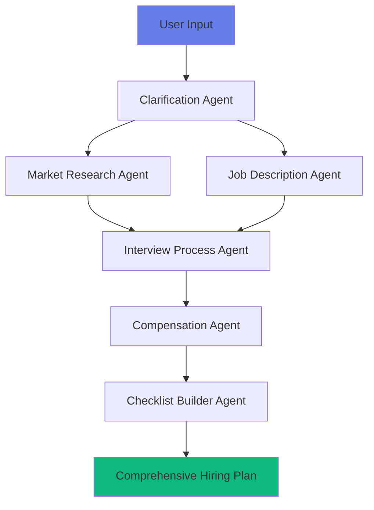

# 🚀 HR Agent - AI-Powered Company Hiring Assistant

<div align="center">


**Transform your company hiring process with AI-powered multi-agent intelligence**

[🎯 Features](#-features) • [🚀 Quick Start](#-quick-start) • [🤖 AI Agents](#-ai-agents) • [📊 Demo](#-demo) • [🛠️ Tech Stack](#️-technology-stack)

</div>

---

## 📖 Overview

HR Agent is a revolutionary **AI-powered hiring assistant** designed for HR professionals across all company sizes. Using a sophisticated **multi-agent system** built with LangGraph, it transforms the complex hiring process into an intelligent, streamlined workflow that generates comprehensive hiring plans, job descriptions, interview processes, and actionable checklists.

### ✨ What Makes HR Agent Special?

- 🧠 **6 Specialized AI Agents** working in harmony
- 🎨 **Beautiful Modern UI** with colorful gradients and animations  
- 💬 **Intelligent Chat Assistant** for hiring guidance
- 📊 **Real-time Analytics** and usage insights
- 🔄 **Session-based Memory** for persistent conversations
- 🌐 **Market Research Integration** with Google Search API

---

## 🎯 Features

### 🤖 **Multi-Agent Intelligence**
- **Clarification Agent**: Extracts hiring requirements and asks smart follow-up questions
- **Market Research Agent**: Gathers real-time salary data and market insights
- **Job Description Agent**: Creates compelling, tailored job descriptions
- **Interview Process Agent**: Designs structured interview workflows with questions
- **Compensation Agent**: Suggests competitive compensation packages
- **Checklist Builder Agent**: Generates actionable hiring timelines and checklists

### 🎨 **Modern Web Interface**
- **Streamlit Frontend**: Beautiful, responsive UI with gradient designs
- **Interactive Forms**: Structured input with dropdowns and multi-select options
- **Real-time Chat**: Context-aware conversations with AI assistants
- **Analytics Dashboard**: Visual insights with charts and performance metrics
- **Session Management**: Persistent state across multiple interactions

### 📊 **Advanced Analytics**
- Usage tracking and performance monitoring
- Peak hours analysis and activity trends
- Success rate and error tracking
- User engagement metrics and session analytics

---

## 🚀 Quick Start

### 📋 Prerequisites

- **Python 3.8+**
- **OpenAI API Key** ([Get one here](https://platform.openai.com/api-keys))
- **Google Custom Search API Key** (optional, for enhanced market research)

### ⚡ Installation

1. **Clone the repository:**
   ```bash
   git clone https://github.com/yourusername/HR_Agent.git
   cd HR_Agent
   ```

2. **Install dependencies:**
   ```bash
   pip install -r requirements.txt
   ```

3. **Set up environment variables:**
   Create a `.env` file in the root directory:
   ```env
   OPENAI_API_KEY=your_openai_api_key_here
   GOOGLE_API_KEY=your_google_api_key_here  # Optional
   GOOGLE_CSE_ID=your_custom_search_engine_id  # Optional
   ```

4. **Start the backend server:**
   ```bash
   python server.py
   ```

5. **Launch the frontend (in a new terminal):**
   ```bash
   streamlit run streamlit_app.py
   ```

6. **Open your browser:**
   - **Frontend**: http://localhost:8501
   - **Backend API**: http://localhost:8001

---

## 🤖 AI Agents Architecture

<div align="center">



</div>

### 🎯 **Agent Responsibilities**

| Agent | Purpose | Key Outputs |
|-------|---------|-------------|
| 🔍 **Clarification** | Extract requirements & ask questions | Structured hiring needs, clarifying questions |
| 📊 **Market Research** | Gather salary & market data | Compensation ranges, market demand, competition |
| 📝 **Job Description** | Create tailored job postings | Professional JDs with requirements & responsibilities |
| 🎤 **Interview Process** | Design interview workflows | Interview stages, questions, evaluation criteria |
| 💰 **Compensation** | Suggest competitive packages | Salary ranges, benefits, equity recommendations |
| ✅ **Checklist Builder** | Generate actionable plans | Timeline, tasks, hiring checklist, master plan |

---

## 🛠️ Technology Stack

### **Backend**
- **FastAPI**: High-performance async API framework
- **LangGraph**: Multi-agent orchestration and workflow management
- **LangChain**: AI agent framework and tool integration
- **OpenAI GPT-4o-mini**: Advanced language model for intelligent responses

### **Frontend**
- **Streamlit**: Modern web app framework with beautiful UI
- **Plotly**: Interactive charts and data visualizations
- **Custom CSS**: Gradient designs and smooth animations

### **Integrations**
- **Google Custom Search API**: Real-time market research
- **JSON File Storage**: Session persistence and memory management
- **Built-in Analytics**: Usage tracking and performance monitoring

---

## 📊 Demo

### 🎨 **Beautiful Modern Interface**

The HR Agent features a stunning, colorful interface with:
- **Gradient backgrounds** and smooth animations
- **Interactive cards** with hover effects
- **Professional typography** using Google Fonts
- **Responsive design** that works on all devices

### 💼 **Sample Hiring Plan Generation**

**Input**: *"I need to hire a founding engineer and a GenAI intern for my AI company"*

**Output**: Complete hiring plan including:
- 📋 Clarified requirements and follow-up questions
- 💰 Market research with salary ranges ($120k-$180k for engineer, $60k-$80k for intern)
- 📝 Tailored job descriptions with technical requirements
- 🎤 Structured interview processes (technical, cultural, final rounds)
- 💵 Competitive compensation packages with equity options
- ✅ 30-day hiring timeline with actionable tasks

---

## 🚦 API Endpoints

| Endpoint | Method | Description |
|----------|--------|-------------|
| `/api/sessions` | POST | Create new hiring session |
| `/api/sessions` | GET | List all sessions |
| `/api/generate_hiring_plan` | POST | Generate comprehensive hiring plan |
| `/api/chat` | POST | Chat with AI assistant |
| `/api/analytics` | GET | Get usage analytics |

---

## 📁 Project Structure

```
HR_Agent/
├── 🚀 server.py                 # FastAPI backend server
├── 🎨 streamlit_app.py          # Streamlit frontend
├── 📦 requirements.txt          # Python dependencies
├── 🔧 .env                      # Environment variables
├── 🤖 agents/                   # AI agent implementations
│   ├── hiring_orchestrator.py   # Main orchestrator
│   ├── clarification_agent.py   # Requirements extraction
│   ├── market_research_agent.py # Salary & market data
│   ├── job_description_agent.py # JD generation
│   ├── interview_process_agent.py # Interview design
│   ├── compensation_agent.py    # Compensation planning
│   └── checklist_builder_agent.py # Action plans
├── 🛠️ utils/                    # Utility modules
│   ├── memory_manager.py        # Session management
│   ├── analytics.py             # Usage tracking
│   └── tools.py                 # External integrations
└── 📊 data/                     # Session & analytics data
    ├── sessions/                # Session storage
    └── analytics/               # Usage metrics
```

---

## 🔧 Configuration

### **Environment Variables**

| Variable | Required | Description |
|----------|----------|-------------|
| `OPENAI_API_KEY` | ✅ Yes | OpenAI API key for GPT-4o-mini |
| `GOOGLE_API_KEY` | ❌ Optional | Google API key for market research |
| `GOOGLE_CSE_ID` | ❌ Optional | Custom Search Engine ID |

### **Customization Options**

- **Agent Prompts**: Modify agent behavior in `/agents/` directory
- **UI Styling**: Update CSS in `streamlit_app.py`
- **API Configuration**: Adjust settings in `server.py`
- **Memory Storage**: Configure persistence in `utils/memory_manager.py`

---

## 🤝 Contributing

We welcome contributions! Here's how you can help:

1. **Fork the repository**
2. **Create a feature branch**: `git checkout -b feature/amazing-feature`
3. **Commit your changes**: `git commit -m 'Add amazing feature'`
4. **Push to the branch**: `git push origin feature/amazing-feature`
5. **Open a Pull Request**

### 🐛 **Bug Reports**
Found a bug? Please open an issue with:
- Clear description of the problem
- Steps to reproduce
- Expected vs actual behavior
- Screenshots (if applicable)

### 💡 **Feature Requests**
Have an idea? We'd love to hear it! Open an issue with:
- Clear description of the feature
- Use case and benefits
- Implementation suggestions

---

## 📄 License

This project is licensed under the **MIT License** - see the [LICENSE](LICENSE) file for details.

---

## 🚀 Running the Application

### Start the Backend Server
```bash
python server.py
```
The API will be available at `http://localhost:8000`

### Start the Streamlit Frontend
```bash
streamlit run streamlit_app.py
```
The web interface will open at `http://localhost:8501`

## 💡 Usage

1. **Create a New Session**: Click "New Hiring Session" in the sidebar
2. **Generate Hiring Plan**: Describe your hiring needs (e.g., "I need to hire a founding engineer and a GenAI intern")
3. **Review the Plan**: Explore job descriptions, interview processes, compensation, and checklists
4. **Chat with Assistant**: Ask follow-up questions about your hiring plan
5. **View Analytics**: Monitor usage and performance metrics

## 📊 Example Workflow

```
User Input: "I need to hire a founding engineer. Can you help?"

AI Agents Process:
├── Clarification Agent: Extracts roles, asks about budget, timeline, skills
├── Market Research Agent: Searches for salary data and market trends
├── Job Description Agent: Creates tailored job descriptions
├── Interview Process Agent: Designs interview stages and questions
├── Compensation Agent: Suggests competitive packages
└── Checklist Builder Agent: Creates hiring timeline and action items

Output: Comprehensive hiring plan with all components
```

## 🎯 Key Features

### Multi-Step Reasoning
- Agents pass information between each other
- Context-aware decision making
- Structured workflow with dependencies

### Tool Integration
- Google Search for market research
- Email template generation
- Document creation utilities

### Memory & State Management
- Session-based persistence
- Chat history retention
- Plan storage and retrieval

### Analytics & Tracking
- Usage metrics and patterns
- Performance monitoring
- Error tracking and debugging

## 📁 Project Structure

```
HR_Agent/
├── agents/                 # AI agent implementations
│   ├── clarification_agent.py
│   ├── market_research_agent.py
│   ├── job_description_agent.py
│   ├── interview_process_agent.py
│   ├── compensation_agent.py
│   └── checklist_builder_agent.py
├── utils/                  # Utility modules
│   ├── tools.py           # Google Search, Email tools
│   ├── memory_manager.py  # Session management
│   └── analytics.py       # Usage tracking
├── data/                   # Storage directory (auto-created)
├── server.py              # FastAPI backend
├── streamlit_app.py       # Streamlit frontend
├── requirements.txt       # Python dependencies
├── .env                   # Environment variables
└── README.md             # This file
```

## 🔍 API Endpoints

- `POST /api/sessions` - Create new session
- `POST /api/generate_hiring_plan` - Generate hiring plan
- `POST /api/chat` - Chat with AI assistant
- `GET /api/sessions/{id}` - Get session data
- `GET /api/sessions` - List all sessions
- `GET /api/analytics` - Get usage analytics

## 🎨 Streamlit Interface

- **Home**: Overview and system status
- **Generate Plan**: Create hiring plans with AI agents
- **Chat Assistant**: Interactive Q&A about hiring
- **Analytics**: Usage metrics and performance data
- **Sessions**: History of all hiring sessions
